

# PA4 Submission: TaskFlow Pipeline

Copy this file to <code style="color:#111827;background:#ddd6fe;padding:2px 4px;border-radius:4px;">SUBMISSION.md</code>. Put every screenshot in <code style="color:#111827;background:#ddd6fe;padding:2px 4px;border-radius:4px;">docs/</code>, embed it under the correct task, and write a short description below each image explaining what it proves. The grader should not need any file outside this repository.

## Student Information

| Field | Value |
|---|---|
| Name | Maha Amer |
| Roll Number | 24030001 |
| GitHub Repository URL | https://github.com/MahaAmer2000/CS487-PA4|
| Resource Group | `rg-sp26-24030001` |
| Assigned Region |  `ukwest` |

## Evidence Rules

- Use relative image paths, for example: ``.
- Every image must have a 1-3 sentence description below it.
- Azure Portal screenshots must show the resource name and enough page context to identify the service.
- CLI screenshots must show the command and output.
- Mask secrets such as function keys, ACR passwords, and storage connection strings.

## Task 1: App Service Web App (15 points)

### Evidence 1.1: Forked Repository

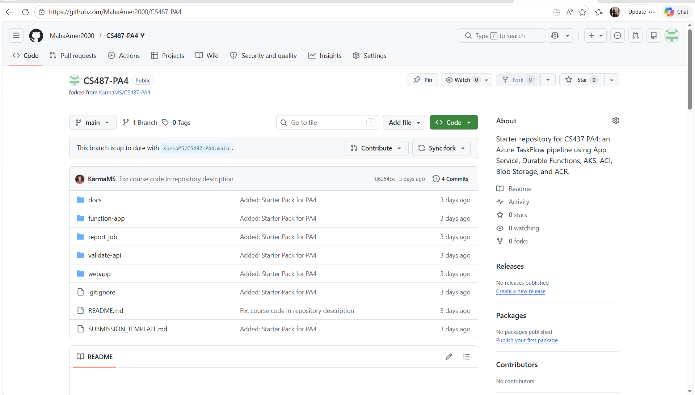

**Description:**  
This is my forked version of the PA4 starter repository. It contains all the required project structure and files, and serves as my working repository for implementing and deploying the assignment tasks.

### Evidence 1.2: App Service Overview

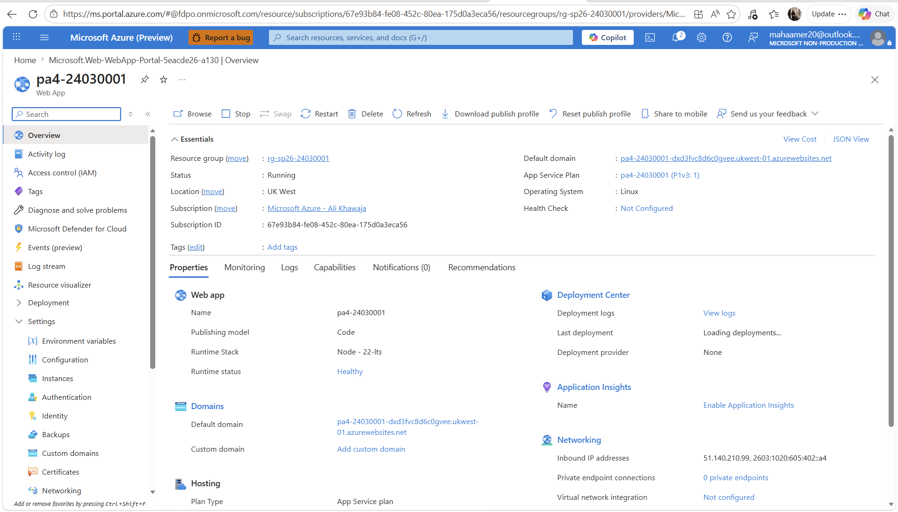

Description: This screenshot shows the Azure App Service Web App named `pa4-24030001` in the resource group `rg-sp26-24030001`, deployed in the `UKWest` region. The runtime stack is Node.js (Linux), and the application is in Running state. The public URL of the web app is: https://pa4-24030001-dxd3fvc8d6c0gvee.ukwest-01.azurewebsites.net

### Evidence 1.3: Deployment Center / GitHub Actions

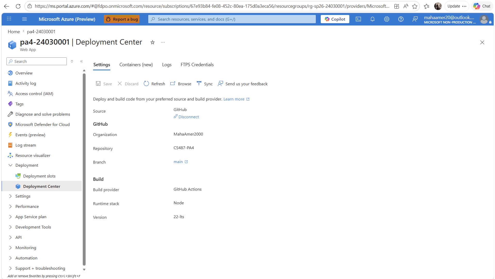

Description: This screenshot shows that the Azure Web App is connected to my forked GitHub repository (`CS487-PA4`) using GitHub Actions for continuous deployment. The workflow is triggered on every push to the `main` branch, automatically building the Node.js application from the `webapp` directory and deploying it to Azure App Service. This setup ensures seamless CI/CD integration between GitHub and Azure.

### Evidence 1.4: Live Web UI

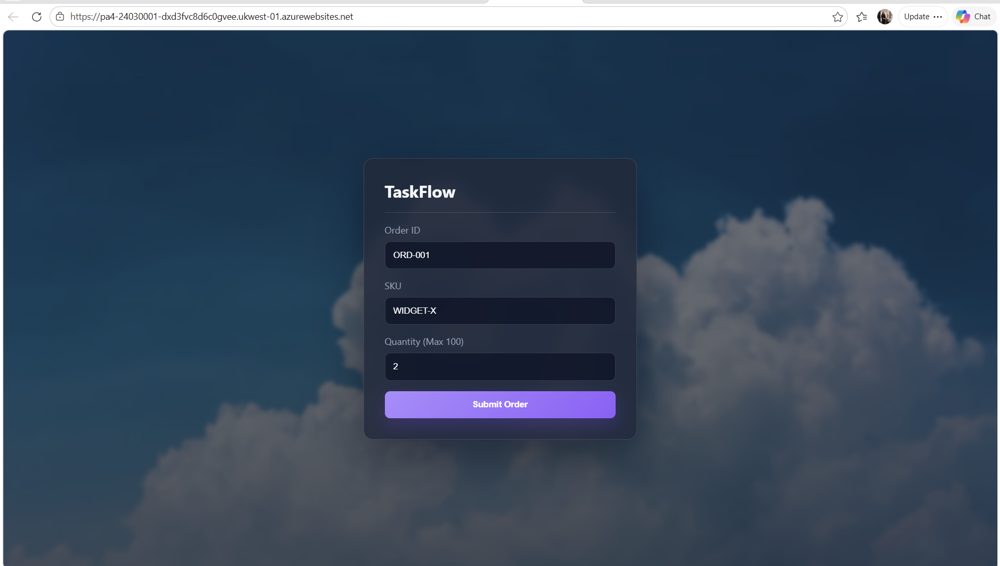
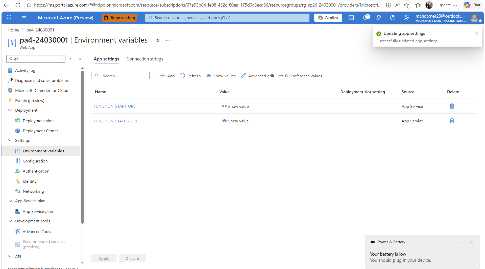

Description: This screenshot shows the TaskFlow web interface successfully loaded in a browser from the deployed Azure App Service. It confirms that the frontend is being served correctly by the Node.js application, and the Web App is accessible via its public URL. The UI loads as expected, indicating that the deployment and hosting configuration are working properly.

---

## Task 2: Azure Container Registry (15 points)

### Evidence 2.1: ACR Overview

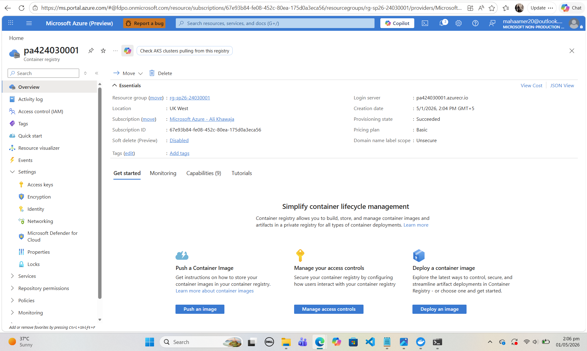

Description: This screenshot shows the Azure Container Registry (ACR) instance `crpa424030001` in the Azure portal. It confirms that the registry has been successfully created and is ready for use in the TaskFlow pipeline. The registry is configured with the **Basic SKU** and is associated with the resource group `rg-sp26-24030001`, ensuring it can store and manage Docker images for deployment to Azure services such as AKS, ACI, and Azure Functions.

### Evidence 2.2: Docker Builds

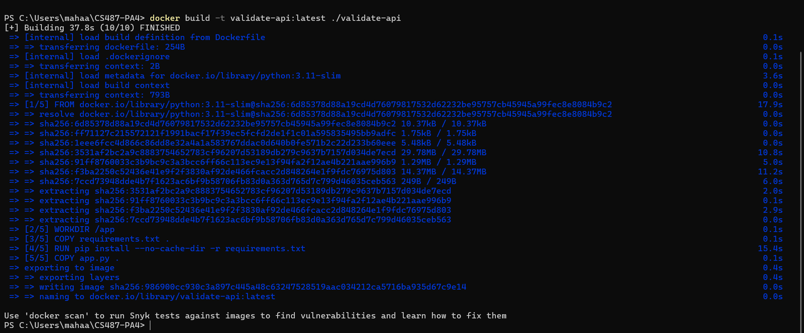  
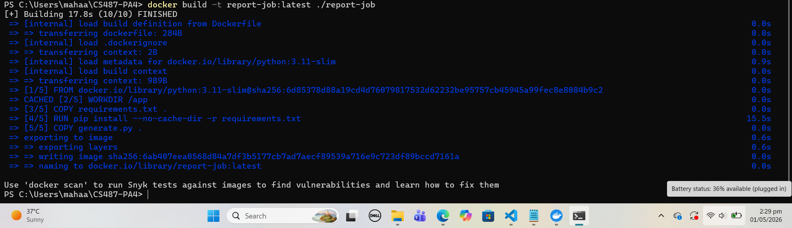  
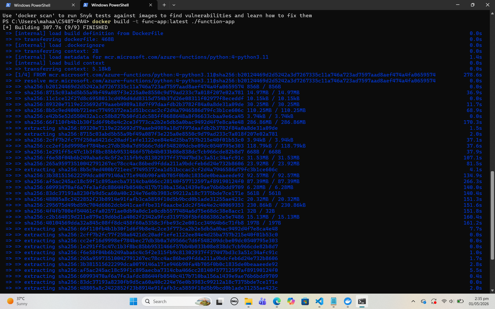  

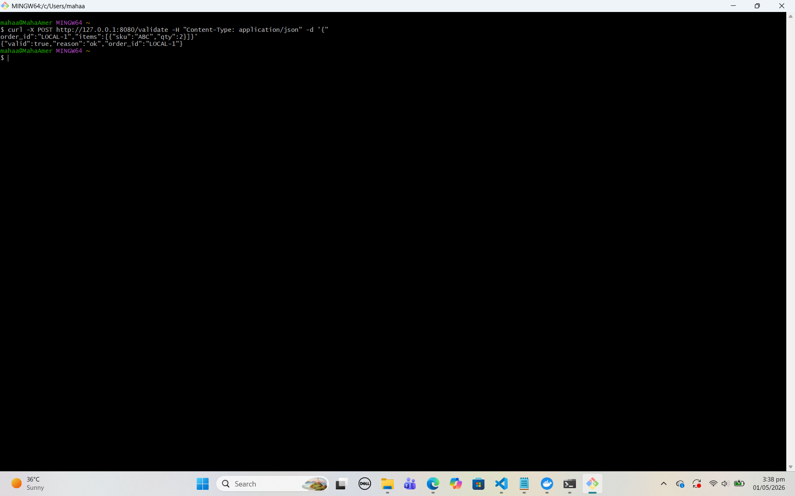

Description: These screenshots show the successful local Docker builds for all three required services in the TaskFlow pipeline. The `validate-api` image was built from the `validate-api/` folder, the `report-job` image was built from the `report-job/` folder, and the `func-app` image was built from the `function-app/` folder. Each build confirms that the Dockerfiles are correctly configured and that all dependencies were installed successfully, resulting in valid container images ready for tagging and deployment to Azure Container Registry.

### Evidence 2.3: ACR Repositories

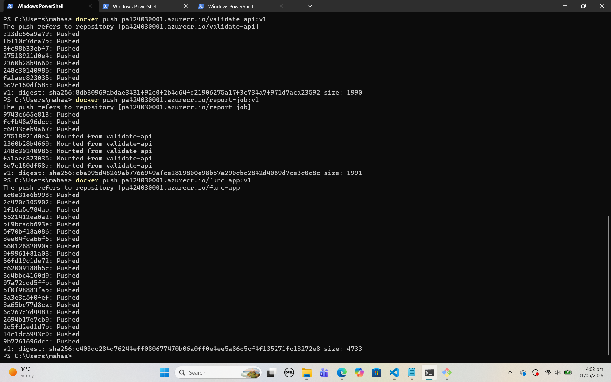  
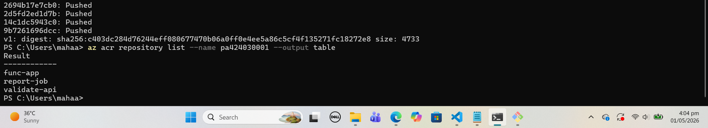

Description: This evidence confirms that all three Docker images were successfully pushed to Azure Container Registry (ACR). The repositories `validate-api:v1`, `report-job:v1`, and `func-app:v1` are visible in the registry, verifying that the container images were correctly tagged and uploaded. This step ensures that all services are now stored in ACR and ready for deployment to AKS, ACI, and Azure Functions as part of the TaskFlow pipeline.

---

## Task 3: Durable Function Implementation (12 points)

### Evidence 3.1: Completed Function Code

[function_app.py](https://github.com/MahaAmer2000/CS487-PA4/blob/main/function-app/function_app.py)

**Description:**  
The orchestrator function coordinates the full order-processing workflow using Azure Durable Functions. It first triggers a validation activity (`validate_activity`) that sends the order to the external validation API and checks whether the order is valid. If the validation succeeds, the orchestrator proceeds to invoke the reporting activity (`report_activity`), which generates and submits a report for the processed order. This chaining ensures that validation is completed before any report generation, maintaining a reliable and sequential workflow with proper fault isolation between activities.

### Evidence 3.2: Local Function Handler Listing

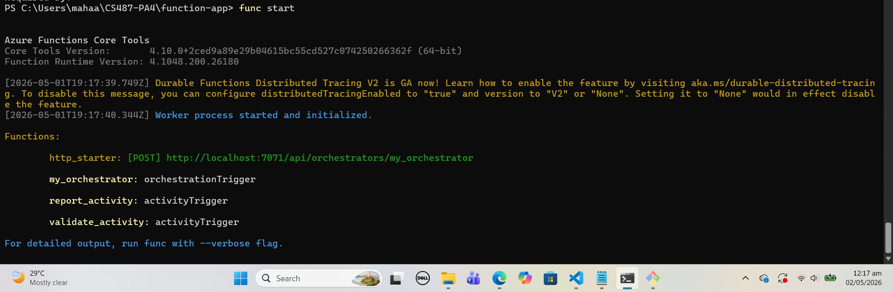

**Description:**  
The Durable Functions runtime successfully discovered and registered all function handlers when running `func start`. This includes the HTTP starter function (`http_starter`), the orchestrator function (`my_orchestrator`), and the activity functions (`validate_activity` and `report_activity`). The presence of these handlers in the startup logs confirms that the function app is correctly configured, and the Durable Functions framework is able to route HTTP triggers and orchestrate activity execution as expected.
---

## Task 4: Function App Container Deployment (8 points)

### Evidence 4.1: Function App Container Configuration

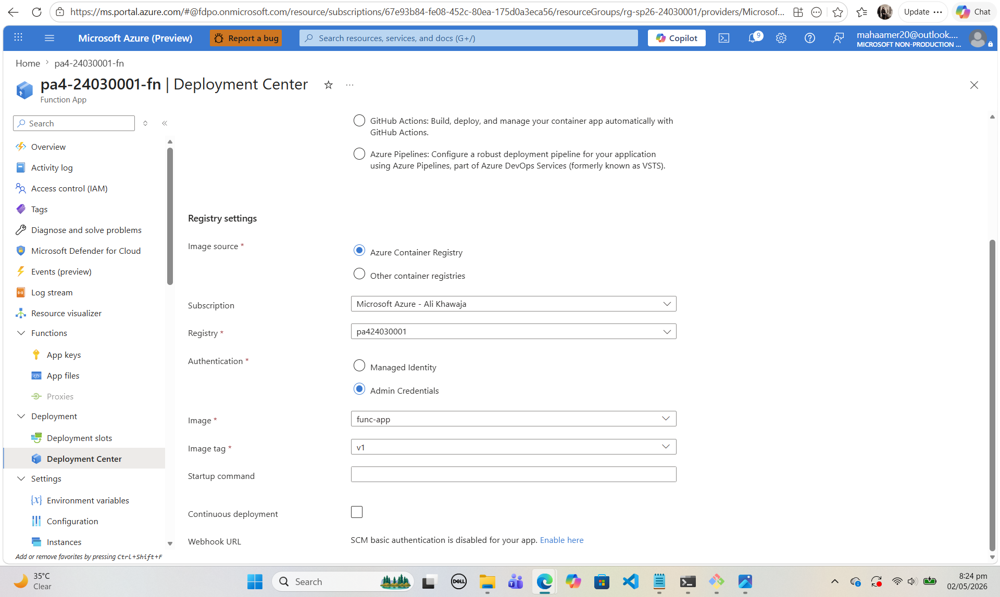
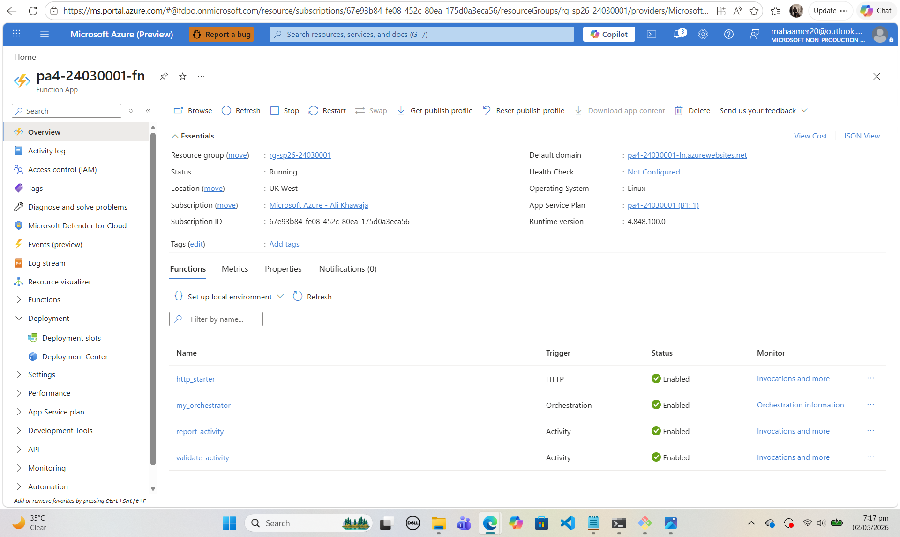

**Description:**  
The Function App **pa4-24030001-fn** is successfully configured to run using a custom container image hosted in Azure Container Registry (ACR). The deployed image is `func-app:v1`, pulled from the registry URI `pa424030001.azurecr.io/func-app:v1`. This confirms that the Function App is correctly set up for container-based deployment and is using the intended image version for execution.

### Evidence 4.2: Orchestration Smoke Test

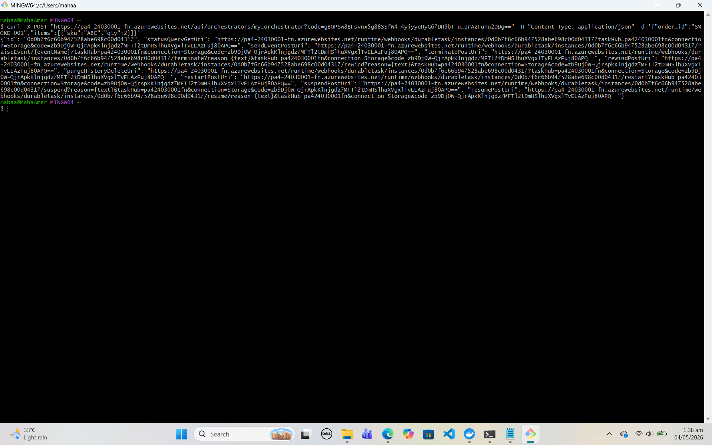

**Description:**  
The `curl` request successfully triggers the Durable Function orchestrator and returns a response containing an `id` and `statusQueryGetUri`. The `id` represents the unique instance ID of the orchestration, confirming that a new workflow instance has been created. The `statusQueryGetUri` provides a management endpoint that can be used to monitor the execution status of the orchestration. The presence of these fields verifies that the Function App is running correctly, the HTTP trigger is functional, and the Durable Functions runtime is successfully initiating and managing orchestration instances.

### Evidence 4.3: Expected Failed Status Before Downstream Wiring

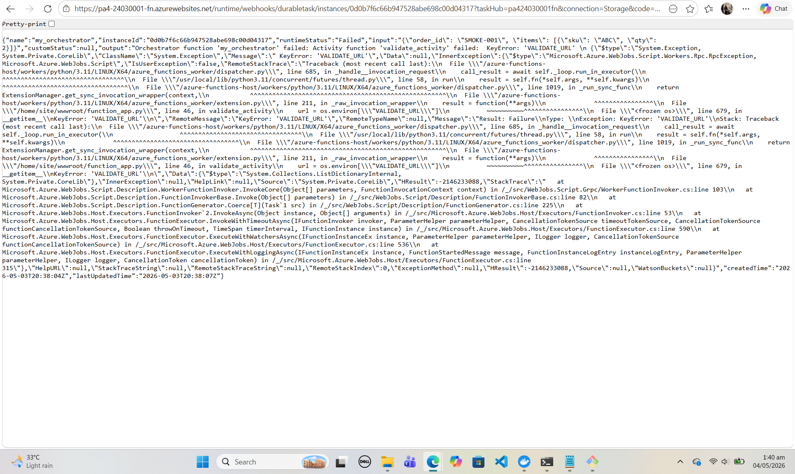

**Description:**  
The status query response shows that the orchestration transitions from `Running` to `Failed`, which is expected at this stage. The failure occurs because the orchestrator attempts to call the `validate_activity`, which depends on the `VALIDATE_URL` configuration that has not yet been set. This confirms that the Durable Function orchestration is correctly executing and progressing through its workflow, and that the failure is due to a missing downstream service rather than an issue with deployment or orchestration logic. The presence of the failure state verifies that the system is functioning end-to-end up to the point of external service integration.

---

## Task 5: AKS Validator (15 points)

### Evidence 5.1: AKS Cluster

**Description:**  
The AKS cluster `aks-24030001` has been successfully created and is in a Succeeded state. The cluster is deployed with 1 node in the node pool, running on a standard VM size (as configured during setup). It is hosted in the `rg-sp26-24030001` resource group and deployed in the selected Azure region. The cluster is fully operational and ready to schedule workloads.

### Evidence 5.2: Kubernetes Nodes and Pods

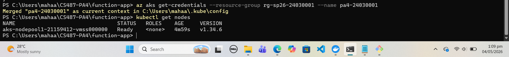

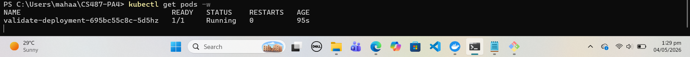

**Description:**  
The Kubernetes cluster is successfully running with one active node in a Ready state. The validator pod has been successfully scheduled onto the node and is in the Running state with 1/1 containers ready, confirming that the deployment is healthy and the container image was pulled successfully from ACR.

### Evidence 5.3: Kubernetes Service

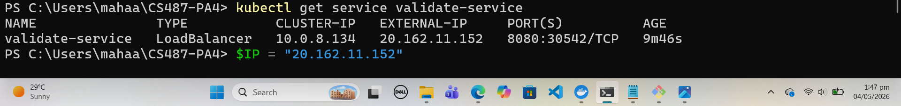

**Description:**  
The `validate-service` Kubernetes service is exposed using a LoadBalancer type, which provisions a public external IP address. The service is accessible at the external IP `20.162.11.152` on port `8080`, enabling public access to the validator API endpoint.

### Evidence 5.4: Validator API Tests

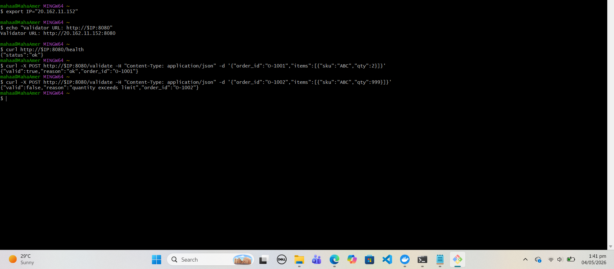

**Description:**  
The validator API is successfully deployed and accessible via the Kubernetes LoadBalancer. The `/health` endpoint returns a successful response confirming the service is running. The `/validate` endpoint correctly processes orders: it accepts valid requests where item quantities are within allowed limits, and rejects invalid requests where quantity exceeds 100, returning `valid: false` with an appropriate error message. This confirms that the validation logic is functioning as expected.

### Evidence 5.5: Function App `VALIDATE_URL`

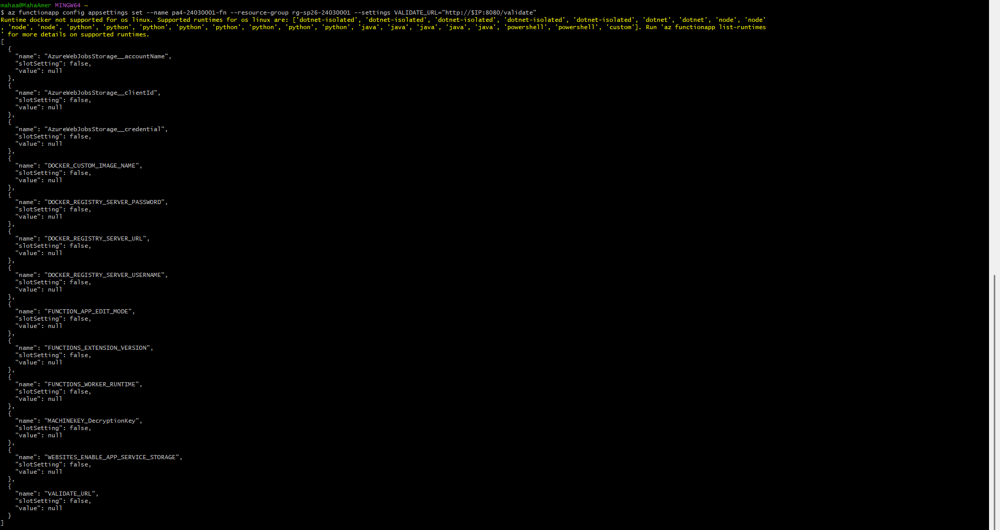

**Description:**  
The Azure Function App has been configured with an application setting `VALIDATE_URL`, which points to the Kubernetes validator service endpoint (`http://20.162.11.152:8080/validate`). This allows the Durable Function’s `validate_activity` to communicate with the AKS-hosted validator API. When triggered, the function sends HTTP requests to this URL to validate order data, enabling seamless integration between the Function App and the Kubernetes microservice.

### Evidence 5.6: AKS Idle Behavior

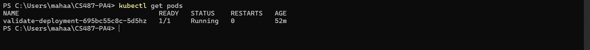

**Description:**  
The AKS cluster remains stable even when no requests are being processed. The validator pod stays in a Running state with 1/1 containers ready and no restarts, confirming that the service continues to run in the background. This demonstrates that Kubernetes maintains persistent workloads and does not shut down resources when idle.

---

## Task 6: ACI Report Job (15 points)

### Evidence 6.1: Blob Container

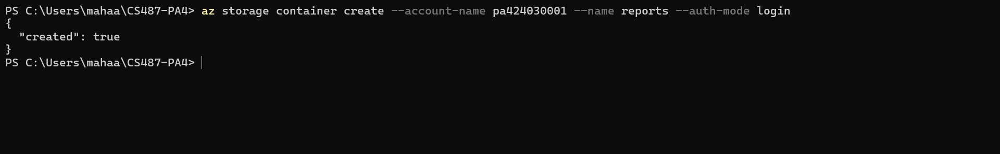

**Description:**  
The `reports` blob container was successfully created in Azure Storage. This container serves as the persistent storage location for all generated PDF reports produced by the ACI report-job. Each execution of the report generator uploads a PDF file (e.g., `TEST-001.pdf`) into this container, making the reports accessible for later retrieval and verification.

### Evidence 6.2: Manual ACI Run

The container `ci-report-test` was executed manually using Azure Container Instances. The final state of the container is **Succeeded**, meaning the job completed successfully and exited as expected under the `Never` restart policy. This confirms that the report generation workflow ran correctly inside ACI, including PDF creation and upload to Azure Blob Storage.

### Evidence 6.3: ACI Logs

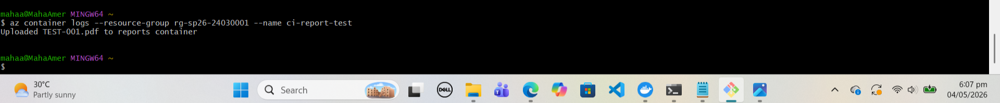

The logs show the execution of the `report-job` inside the container. The application successfully processed the input order data, generated a PDF report, and uploaded it to the Azure Blob Storage `reports` container. The log entry **"Uploaded TEST-001.pdf to reports container"** confirms successful authentication using Managed Identity and successful upload operation.

### Evidence 6.4: Generated PDF

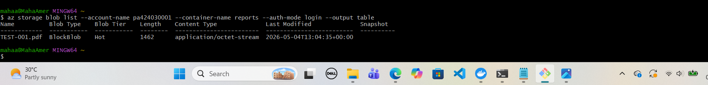

This screenshot shows the file `TEST-001.pdf` stored in the Azure Blob Storage `reports` container. It proves that the ACI job successfully wrote output to cloud storage. The presence of the PDF confirms end-to-end execution: input processing → PDF generation → secure upload using Managed Identity → successful persistence in Azure Blob Storage.

### Evidence 6.5: Function App Managed Identity and IAM

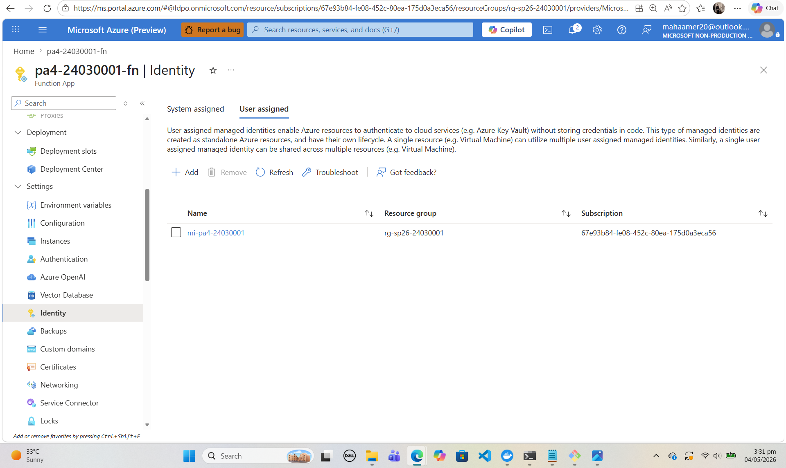  
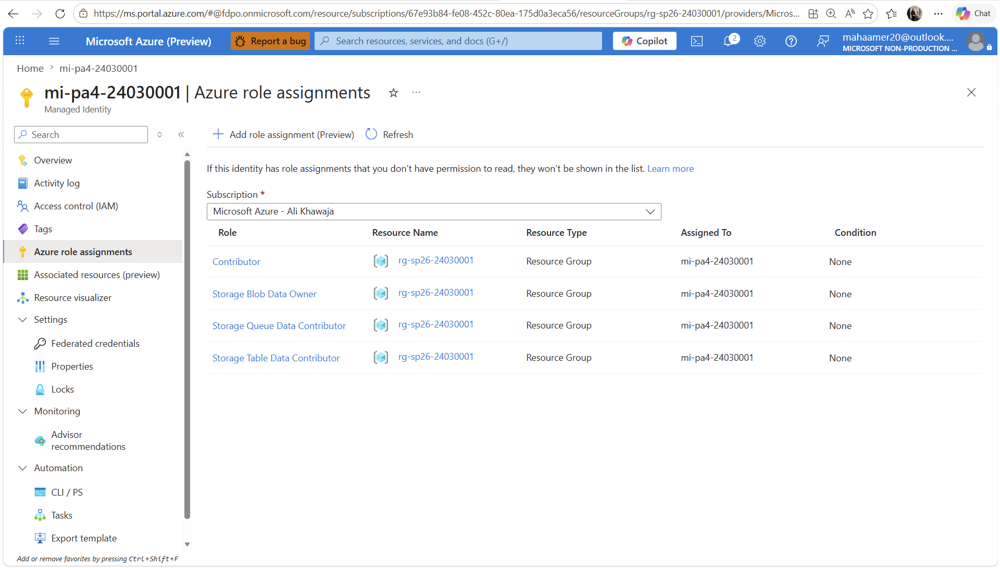

**Description:**  
The Function App uses a system-assigned Managed Identity which is enabled to allow secure, credential-free authentication with Azure services. At the resource group level (`rg-sp26-24030001`), this identity is assigned the **Contributor** role. This permission is required so that the Function App can programmatically create and manage Azure Container Instances (ACI) during report generation. Without this role, the Durable Function would not be able to provision compute resources dynamically, which is essential for executing the report-generation workflow securely and automatically.

### Evidence 6.6: Report App Settings

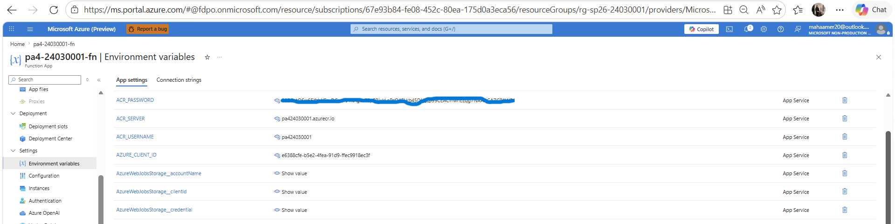  
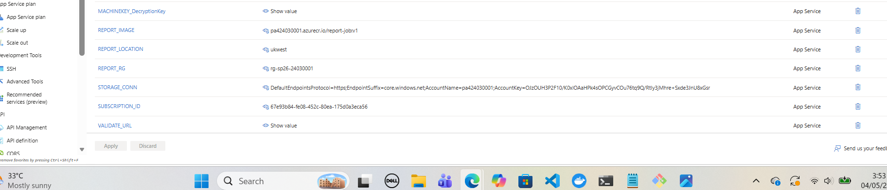

**Description:**  
The Function App configuration includes several environment variables required for the report generation workflow. The `REPORT_*` settings define the ACI image, resource group, and region used to create Azure Container Instances for report generation. The `ACR_*` settings provide authentication details for pulling container images from Azure Container Registry. The `STORAGE_CONN` setting is used by the report-job container to connect to Azure Blob Storage and upload generated PDF reports. The `SUBSCRIPTION_ID` is used by the Function App to identify the correct Azure subscription when provisioning resources. Sensitive values such as passwords are masked for security purposes.

---

## Task 7: End-to-End Pipeline (15 points)

### Evidence 7.1: Web App Wiring

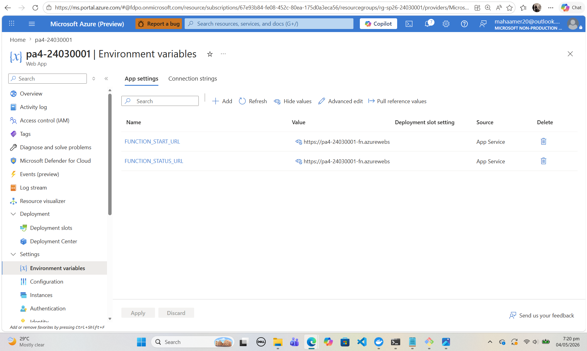

**Description:**

The frontend initiates the Durable Function by sending a POST request to `FUNCTION_START_URL`, which starts a new orchestration instance. It then uses `FUNCTION_STATUS_URL` to periodically poll the status of the workflow until completion. This allows the web app to handle long-running tasks asynchronously while updating the user with the final result.

### Evidence 7.2: Happy Path UI

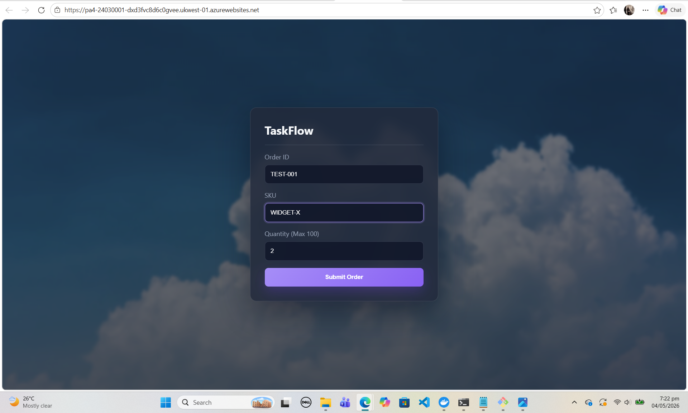
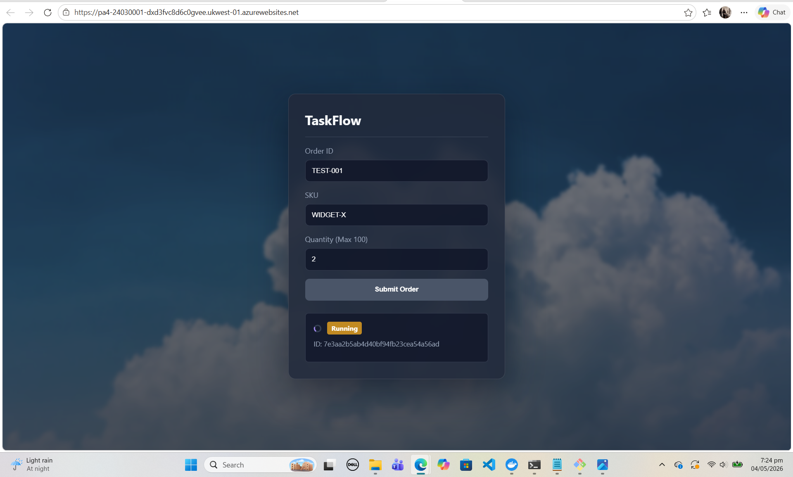

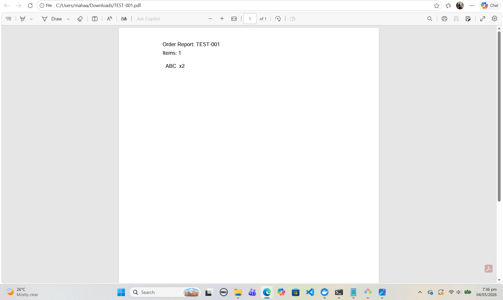

**Description:**

A valid order payload includes a properly structured JSON with fields like `order_id` and `items` (each containing `sku` and `qty`). When submitted, the system validates the order successfully, triggers the report generation via ACI, and completes the workflow by returning a `completed` status along with a downloadable report URL.

### Evidence 7.3: Backend Participation

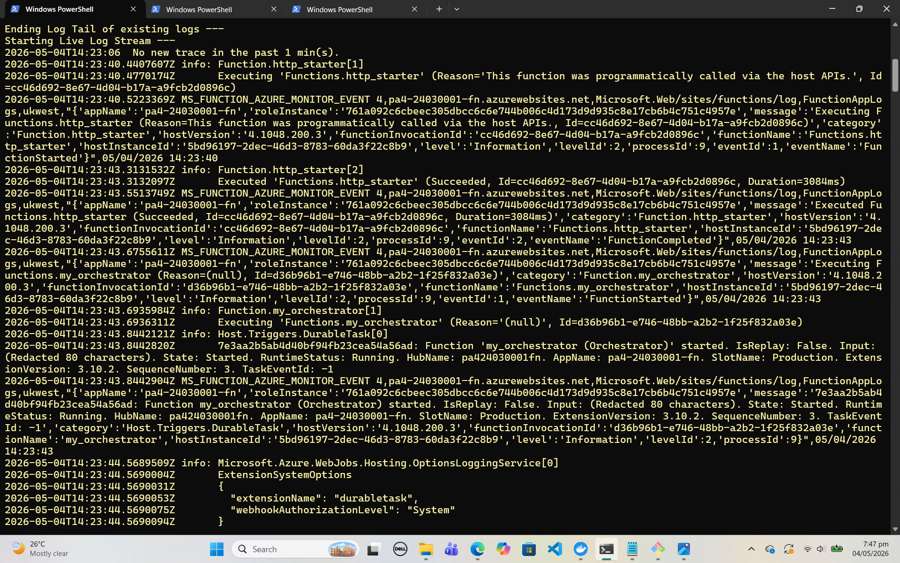
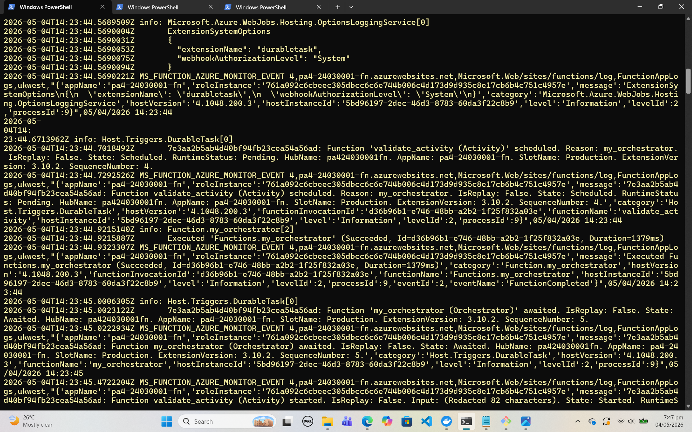
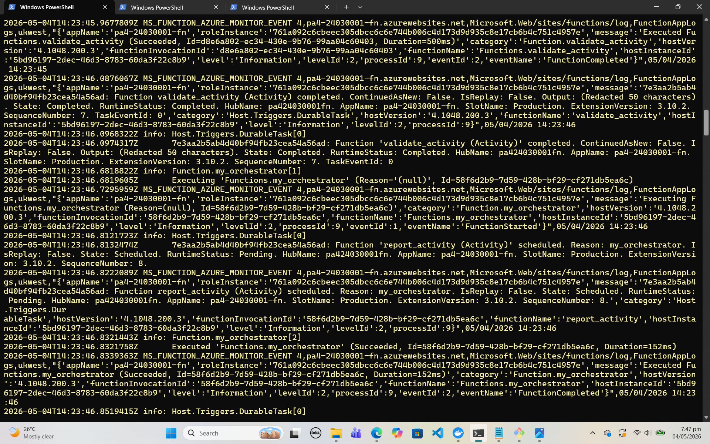
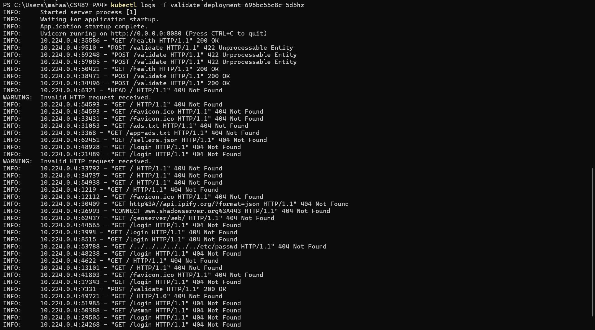
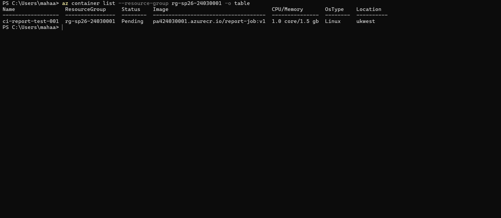
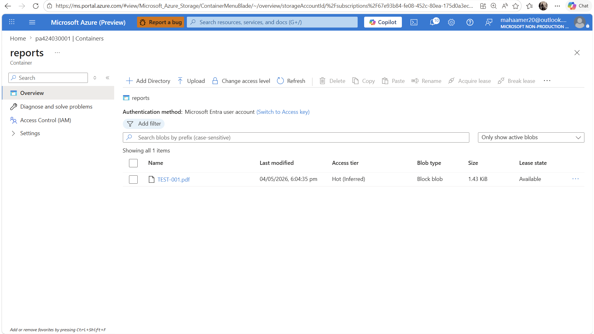

**Description:**

The same `order_id` can be traced across all backend services to verify end-to-end execution. It first appears in the Function App logs during orchestration and validation, then in the AKS validator logs confirming successful validation. Next, it is used to create an ACI container for report generation, and finally the generated PDF with the same `order_id` is stored and verified in Blob Storage.

### Evidence 7.4: Reject Path UI

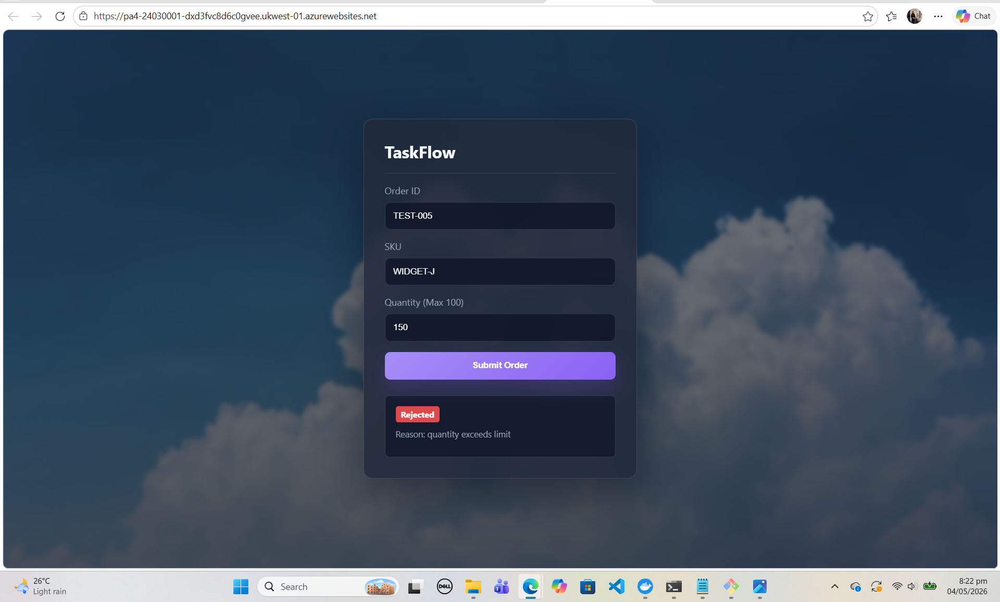
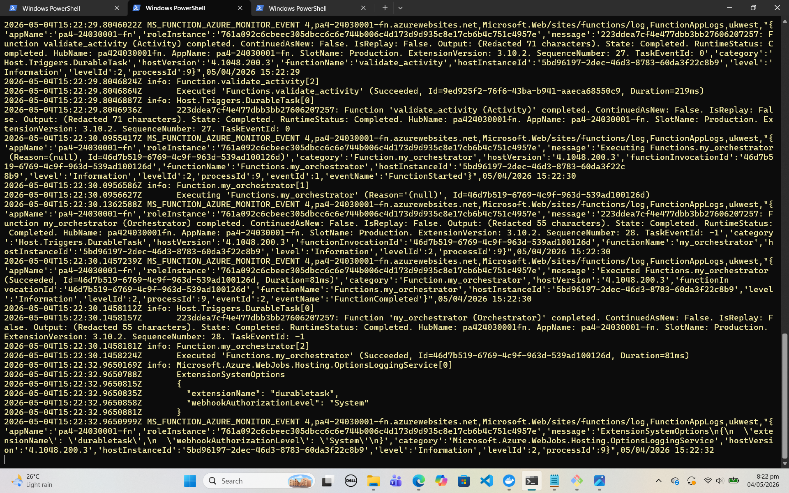
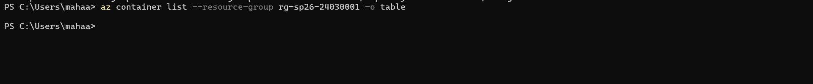

**Description:**

When an order contains an invalid condition such as `qty > 100`, the validation step fails and the orchestrator returns a `rejected` status with a reason. Since the order does not pass validation, the `report_activity` is never triggered, meaning no ACI container is created for report generation.

---

## Task 8: Write-up and Architecture Diagram (5 points)

### Evidence 8.1: Architecture Diagram

[architecture diagram](docs/24030001_architecture_diagram.png)

Description: TODO: Confirm that it shows GitHub, App Service, Durable Function, AKS, ACI, Blob Storage, ACR, and IAM.

### Question 8.2: Service Selection

**App Service:**  
Azure App Service is used to host the frontend web application because it provides a fully managed platform with minimal operational overhead. It supports easy deployment, built-in scaling, and integrates well with backend APIs. The free/low-tier plans make it cost-effective for lightweight workloads like this UI, while still allowing scaling if needed.

**Durable Functions:**  
Durable Functions are used to orchestrate the workflow between validation and report generation. They are ideal for long-running, stateful processes and automatically handle retries, checkpoints, and execution state. This avoids manual state management and ensures reliability even if individual steps fail.

**Azure Kubernetes Service (AKS):**  
AKS is used for the validation service because it supports containerized microservices with scalability and control. It is suitable for continuously running services that may handle multiple requests. While it has a higher operational cost, it provides flexibility, scalability, and production-like deployment behavior.

**Azure Container Instances (ACI):**  
ACI is used for report generation because it is a serverless container service that runs containers on demand. It is cost-efficient for short-lived tasks since you only pay for execution time. This makes it ideal for generating reports without maintaining a long-running service.

### Question 8.3: ACI vs AKS

When AKS is idle for around 10 minutes, the cluster nodes remain running, meaning compute resources are still allocated and incurring cost even if no requests are being processed. In contrast, ACI does not have a concept of being "idle" in the same way; containers are created on demand and terminated after execution, so no cost is incurred when there are no active jobs.

If a malicious user spammed the Submit button 1000 times, ACI would incur the most cost because each request would create a new container instance for report generation. AKS, on the other hand, would continue using already running nodes, so the marginal cost increase would be smaller. This highlights that ACI is cost-efficient for occasional workloads but can become expensive under high-frequency usage.

### Question 8.4: Durable Functions vs Plain HTTP

Using plain HTTP-triggered functions for this workflow would make handling long-running tasks and state management much harder. First, HTTP functions have execution time limits, so the report generation step (which can take up to a minute) could fail due to timeouts. Second, managing the workflow state between validation and reporting would require manual tracking (e.g., storing intermediate results in a database). Durable Functions solve these issues by maintaining state automatically and allowing reliable chaining of tasks with built-in retry and checkpointing mechanisms.

### Question 8.5: Cost Review

TODO: Embed Cost Management screenshot scoped to your resource group.

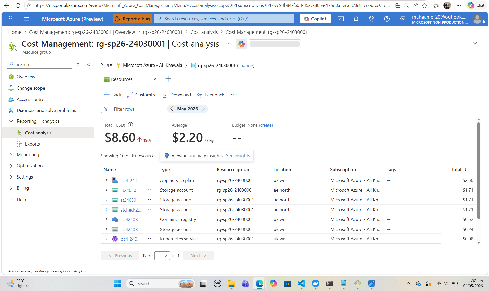

**Description:**

The most expensive resource is the App Service plan which has incurred a cost of approximately $2.50. This higher cost is due to the plan providing dedicated compute infrastructure, memory, and CPU resources required to host and run the web application continuously, unlike serverless components that only charge per execution.

### Question 8.6: Challenges Faced

One major issue encountered was related to authentication when accessing Azure resources. Initially, key-based authentication was used, but it caused failures because the repository had been forked earlier and configurations were outdated. After updating the implementation to use Managed Identity (as per the instructor’s updated version), the authentication issues were resolved.

Another challenge was debugging why ACI containers were not visible. Initially, it seemed like ACI was not being created, but the issue was that the container was being created and deleted very quickly after execution. This was debugged by inspecting logs, adding print statements, and temporarily disabling the delete step to confirm that the container was successfully created and executed.

---
